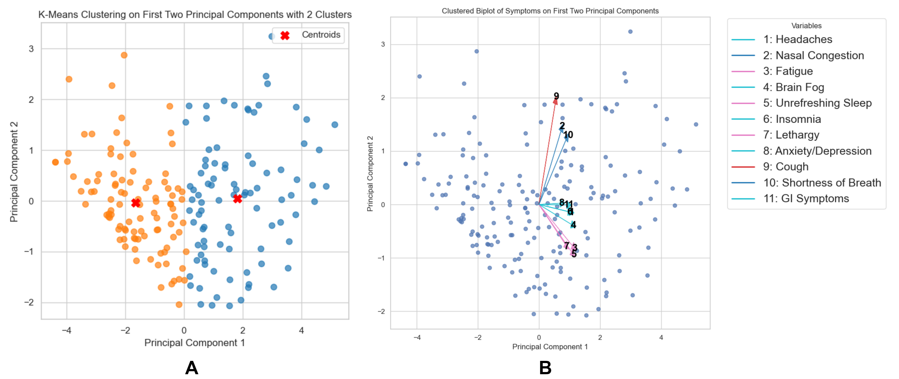
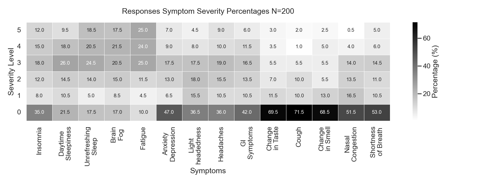

# Analysis on Long Covid Dataset to Assess Sleep Complaints 

## Data Sources: 
Files located in folder `data/raw_data`, and contains 
1. `covid_clinic_three_questions_questionnaire.csv`
   - Dimension: (1134,7) 
2. `ehr_dataset.xlsx`
   - Dimension: (204, 30)
3. `asq_for_study.csv`
   - Dimensions: (200, 528)

Dataset (1) contains the three questions answered by all the population that attended the Sleep Clinic and did not present long covid.
Dataset (2) contains the questionnaire by the 204 samples at the sleep clinic. 
Dataset (3) contains the ASQ of the subjects from dataset. The ASQ dataset contains the already matched subjects from dataset (2) utilizing Fuzzy search. 

### Merging dataset 
The file sources are merged with the script `src/create_datasets_with_asq.py`. The file of that will be used for the analysis of this study is 'data_paths.get('pp_data').get('asq_covid_ehr_cortisol')'

## Pre-processing 
The pre-process was computed in the `src/pre_processing.py`

## Analysis
The file with the main statistical analysis is in `analyses_research_publication.py`, the file contains the analysis of the seven different hypothesis for the study. 

The statistical analysis are hypothesis testing using statistical significance test and PCA with K-means to explore latent space and cluster of disease/symptoms. 

The script explore the following questions:
1. What is the prevalence of sleep disorders in the Long COVID Clinic, measured by validated scales?

2. Are sleep disturbance symptoms connected with other symptoms? Do they commonly occur with certain other symptoms?
3. Do specific sleep disturbances tend to co-occur?
4. Do specific sleep disturbances tend to co-occur? (looking only at medical history)
5. What are the risk factors for long COVID sleep disturbances?
6. Are certain demographic characteristics associated with certain sleep phenotypes?
7. Does the duration of the Long COVID symptoms influence sleep disturbance severity and type?

